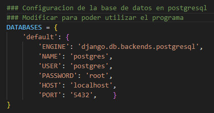

# Nombre del Proyecto

Breve descripción del proyecto y su propósito.

## Tabla de Contenidos

- [Instalación](#instalación)
- [Uso](#uso)


## Instalación

Instrucciones para instalar y configurar el proyecto.

```bash
# Clona el repositorio
git clone [https://github.com/usuario/nombre-del-proyecto.git](https://github.com/jonyxnx/Fullstack_Prueba_Tecnica.git)

# Navega al directorio del proyecto
cd Fullstack_Prueba_Tecnica

# Crea y activa un entorno virtual
python -m venv env
source env/bin/activate  # En Windows usa `env\Scripts\activate`

# Instala las dependencias
pip install -r requirements.txt

# Navega al directorio del proyecto en django
cd prueba_tecnica

# Modifica el archivo '/prueba_tecnica/settings.py' para conectarse con tus credenciales de PostgreSQL


# Realiza las migraciones
python manage.py migrate

# Inicia el servidor de desarrollo
python manage.py runserver

# Ingresa al servidor local con 'http://127.0.0.1:8000/'
