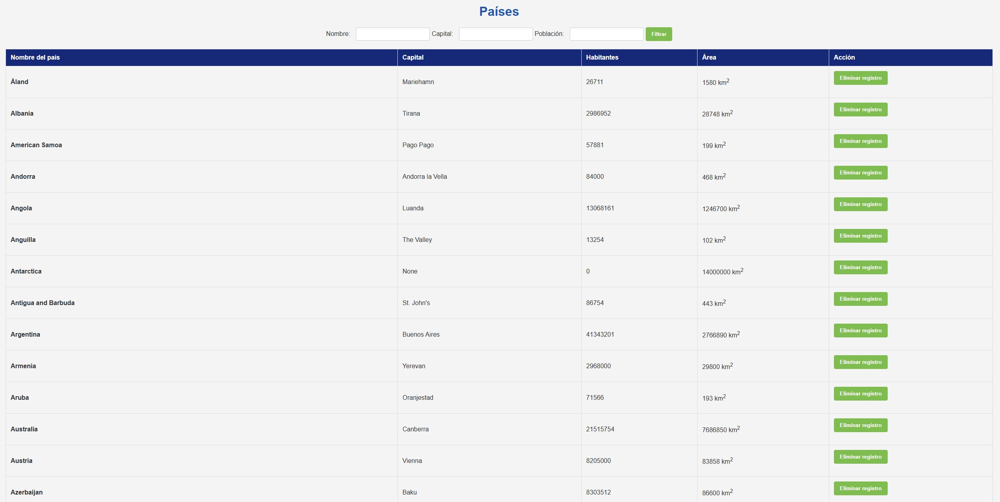
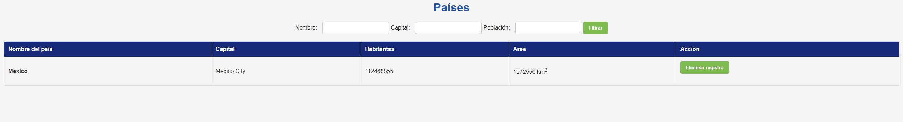
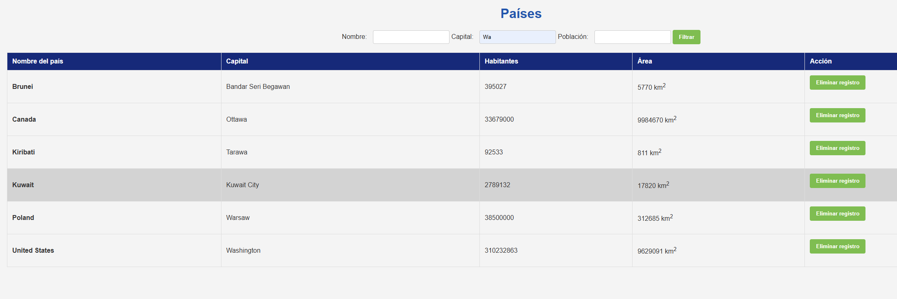
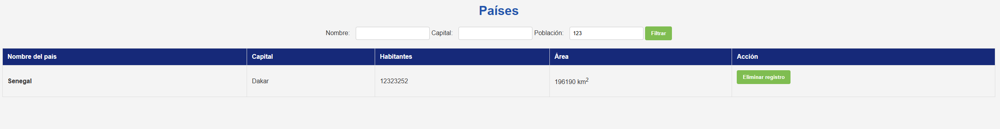
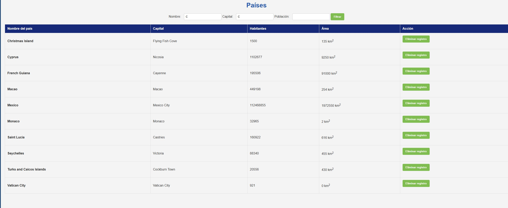

## Contenidos

- [Instalación](#instalación)
- [Uso](#uso)


## Instalación

Instrucciones para instalar y configurar el proyecto.

Clona el repositorio
```bash
git clone https://github.com/jonyxnx/Django_Postgresql.git
```
Navega al directorio del proyecto
```bash
cd Django_Postgresql
```
Crea y activa un entorno virtual

```bash
python -m venv env
source env/bin/activate  # En Windows usa `env\Scripts\activate`
```

Instala las dependencias
```bash
pip install -r requirements.txt
``` 

Navega al directorio del proyecto en django
```bash
cd prueba_tecnica
```

Modifica el archivo '/prueba_tecnica/settings.py' para conectarse con tus credenciales de PostgreSQL
```python
# Coloca aquí tus credenciales
DATABASES = {
    'default': {
        'ENGINE': 'django.db.backends.postgresql',
        'NAME': '',
        'USER': '',
        'PASSWORD': '',
        'HOST': '',
        'PORT': '',    }
}
```

Realiza las migraciones
```bash
python manage.py migrate
```

Inicia el servidor de desarrollo
```bash
python manage.py runserver
```
Ingresa al servidor local con 'http://127.0.0.1:8000/'

## Uso

Dentro de la apliación veremos lo siguiente:



Podemos filtrar por nombre del pais:



Por nombre de la capital:



Por poblacion:



Realizar varios filtrados a la vez:



Así como eliminar resgistros (la eliminación se realiza con un borrado lógico):


### Nota:

Para recuperar los registros tras el borrado podemos ejecutar el siguiente comando desde el bash:

```bash
python manage.py migrate base zero
```
